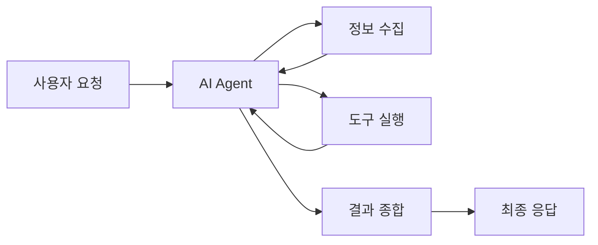

# 1. INTRO: 학습자 로드맵

## 개요

비개발자를 위한 AI 활용 능력 로드맵을 이해하고, AI, Agent, Workflow의 기본 개념을 학습합니다.

---

## 1.1 간단한 대화 도메인 전문가의 자동화

### AI란 무엇인가?

AI (Artificial Intelligence, 인공지능)는 인간의 지능적 행동을 컴퓨터 프로그램으로 구현한 기술입니다. 특히 최근의 대형 언어 모델(LLM, Large Language Model)은 인간의 언어를 이해하고 생성하는 능력을 가집니다.

<!-- INFORAPHIC PLACEHOLDER: AI 정의와 분류 -->

*디자인 필요: AI/ML/DLL/LLM의 관계를 나타내는 벤 다이어그램*

### Agent란 무엇인가?

AI Agent는 스스로 판단하고 행동할 수 있는 AI 시스템입니다. 단순히 질문에 답하는 것을 넘어, 목표를 달성하기 위해 여러 단계의 행동을 수행할 수 있습니다.

### Workflow란 무엇인가?

Workflow는 작업의 흐름을 자동화한 프로세스입니다. 여러 AI 도구와 서비스를 연결하여 반복 작업을 자동화할 수 있습니다.

---

## 1.2 3 Person Unicorn, 사람을 능가하는 AI 성능

### Rewriting Existing Workflow

기존 업무 프로세스를 AI 중심으로 재설정하는 것을 Rewriting Existing Workflow라고 합니다. 단순히 AI를 추가하는 것이 아니라, AI의 강점을 최대한 활용하도록 프로세스를 재구성합니다.

<!-- INFORAPHIC PLACEHOLDER: Workflow 재설정 예시 -->

*디자인 필요: AI 도입 전후의 업무 프로세스 비교*

### AI 성능의 비대칭성

AI는 어떤 분야에서는 사람을 훨씬 능가하지만, 다른 분야에서는 아직 부족합니다. 이를 이해하고 적재적소에 AI를 활용하는 것이 중요합니다.

---

## 1.3 Centaur, Cyborg - AI-사람의 협업 방식

### Centaur 모델

사람과 AI가 함께 결정을 내리는 협업 방식입니다. 체스 Centaur는 인간 선수와 AI가 함께 플레이하여 단독보다 더 높은 성과를 냅니다.

<!-- INFORAPHIC PLACEHOLDER: Centaur 모델 -->

*디자인 필요: 사람과 AI가 함께 결정하는 과정 시각화*

### Cyborg 모델

AI를 도구로 활용하여 사람이 주도적으로 업무를 수행하는 방식입니다. AI는 보조 역할을 하며, 사람이 판단하고 실행합니다.

---

## 1.4 Jagged Edge of Frontier - 오늘의 기술의 최전선 시연

AI의 성능은 분야에 따라 다릅니다. 이를 Jagged Edge라고 부릅니다.

<!-- DEMO VIDEO PLACEHOLDER -->
[DEMO VIDEO: 분야별 SOTA Product 시연 (3분)]

### 분야별 SOTA (State-of-the-Art) 제품

| 분야 | 대표 제품 | 특징 |
|------|-----------|------|
| 대화형 AI | GPT-4, Claude 3.5 | 복잡한 추론과 대화 |
| 이미지 생성 | Midjourney, DALL-E 3 | 고품질 이미지 생성 |
| 음성 생성 | ElevenLabs | 자연스러운 음성 합성 |
| 영상 생성 | Veo 3, Sora | 고품질 영상 생성 |
| 음악 생성 | SUNO AI | 다양한 장르의 음악 생성 |
| 검색 | Perplexity | AI 기반 검색 엔진 |
| 요약 | Kome, Summarize.tech | 긴 텍스트/영상 요약 |
| RAG | NotebookLM | 개인 문서 기반 Q&A |
| 프레젠테이션 | Gamma, Genspark | AI 기반 PPT 생성 |
| 코딩 | Cursor, Lovable | AI 보조 코딩 |

---

## 요약

- **AI**: 인간의 지능적 행동을 컴퓨터로 구현한 기술
- **Agent**: 스스로 판단하고 행동할 수 있는 AI 시스템
- **Workflow**: 작업 흐름을 자동화한 프로세스
- **Centaur**: 사람과 AI가 함께 결정
- **Cyborg**: AI를 도구로 활용
- **Jagged Edge**: AI 성능의 분야별 차이

---

## 다음: 이론 & 주의사항

AI의 기본 원리와 사용 시 주의사항을 알아봅시다.

→ [다음 섹션으로](../02-theory-and-warnings.md)
